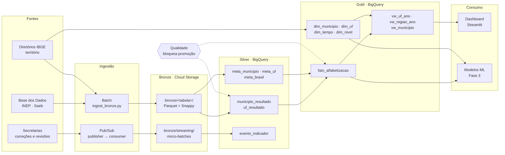

# Pipeline Híbrida para Análise da Alfabetização no Brasil

Pipeline de dados **batch + streaming** em GCP que integra as fontes do
*Compromisso Nacional Criança Alfabetizada* e entrega uma camada analítica
pronta para dashboards, estatística e modelos de machine learning.

**Tech Challenge — Fase 2 · Pós-Tech AI Scientist (FIAP)**

---

## O problema

A alfabetização até o final do 2º ano do ensino fundamental é o alicerce de
toda a trajetória escolar. Uma criança que chega ao 3º ano sem ler com
autonomia carrega essa defasagem por anos, e o custo de remediar cresce a
cada série.

O **Compromisso Nacional Criança Alfabetizada** mobiliza União, estados,
Distrito Federal e municípios com uma meta clara: todas as crianças
alfabetizadas ao final do 2º ano até **2030**.

Para tornar isso mensurável, o INEP realizou em 2023 a pesquisa *Alfabetiza
Brasil* e fixou o ponto de corte de **743 pontos** na escala de proficiência
do Saeb — o patamar a partir do qual uma criança é considerada alfabetizada.
Daí nasce o **Indicador Criança Alfabetizada**, o percentual de estudantes que
atinge esse nível.

### Por que isso exige engenharia de dados

O indicador sozinho não responde à pergunta que importa: *onde intervir
primeiro*. Para chegar lá é preciso cruzar resultados medidos com metas
pactuadas, em três níveis territoriais (Brasil, UF, município), ao longo de
sete anos — e as fontes chegam em formatos e granularidades incompatíveis.

As metas vêm em formato *wide* (uma coluna por ano, 2024 a 2030). Os
resultados vêm em formato *long* (uma linha por ano). Os resultados são
segmentados por rede de ensino; as metas existem só para a rede municipal.
Sem tratamento, o join entre os dois simplesmente não acontece.

**Este projeto é a camada que torna essa análise possível.**

---

## Arquitetura



### Fluxo de dados

| Etapa | O que acontece |
|---|---|
| **1. Ingestão batch** | Query direta no BigQuery público da Base dos Dados → Parquet particionado por ano no Cloud Storage, com `_ingestao_timestamp` e `_fonte` para rastreabilidade |
| **2. Ingestão streaming** | Eventos das secretarias publicados no Pub/Sub → consumidos em micro-batches → zona `bronze/streaming/` |
| **3. Silver** | Limpeza, padronização de chaves, unpivot das metas (wide → long) e integração das bases. Validações de qualidade rodam aqui e **bloqueiam a promoção** em caso de falha |
| **4. Gold** | Modelagem dimensional: fato na granularidade *município × ano*, quatro dimensões e três views analíticas |
| **5. Consumo** | Dashboard Streamlit sobre as views; a Gold fica pronta para o modelo preditivo da Fase 3 |

---

## Modelo dimensional

A Gold segue um **star schema** com grão declarado: **um município, um ano**.

```
                    dim_tempo
                        │
  dim_municipio ── fato_alfabetizacao ── dim_nivel
        │                   │
     dim_uf                 └── taxa_realizada, meta,
                                gap_meta, meta_atingida
```

### Os três casos temporais

A assimetria entre metas e resultados é a característica que mais condiciona
o desenho:

| Ano | Resultado | Meta | Comparação |
|---|---|---|---|
| 2023 | ✅ | ❌ | não existe |
| 2024 | ✅ | ✅ | possível |
| 2025–2030 | ❌ | ✅ | não existe |

Por isso a fato é construída com **FULL OUTER JOIN**: um inner join
descartaria 2023 e toda a trajetória futura até 2030, deixando o painel com
um único ano de dado. Essa assimetria é preservada em todas as views e em
toda a lógica do dashboard.

---

## Tecnologias

| Camada | Ferramenta | Por quê |
|---|---|---|
| Ingestão batch | `basedosdados` + BigQuery | A Base dos Dados hospeda os datasets nativamente no BigQuery público: a ingestão vira uma query, sem download e reupload |
| Ingestão streaming | Cloud Pub/Sub | Serverless, com franquia mensal generosa e garantia de entrega |
| Bronze | Cloud Storage + Parquet/Snappy | Object storage custa uma fração do data warehouse para dado que não é consultado direto |
| Silver / Gold | BigQuery | Colunar e distribuído, cobrança por dado escaneado |
| Processamento | pandas + pyarrow | Volume compatível com processamento single-node; Spark seria overhead |
| Qualidade | Módulo próprio (`quality/`) | Relatório estruturado com dataclass, decisão de bloqueio no chamador |
| Visualização | Streamlit + Plotly | Deploy em minutos, sem custo de licença de BI |

---

## Qualidade de dados

Validação não é log: `quality/validations.py` devolve um `ResultadoValidacao`
estruturado e **quem chama decide** se bloqueia ou apenas registra.

- Duplicidade por chave de negócio
- Nulos em colunas-chave
- Percentual médio de ausência por tabela
- Integridade referencial entre fato e dimensões

**Princípio:** falha de qualidade bloqueia a promoção entre camadas. Dado
inválido que chega à Gold contamina dashboard e modelo — é mais barato falhar
cedo.

### Armadilhas encontradas (e o que ensinaram)

Estas não são hipóteses. São bugs que aconteceram neste projeto:

**Particionar por coluna inexistente replica o dataset inteiro.** As tabelas
de metas foram ingeridas com `partition_cols=["ano"]` sem possuir a coluna.
Resultado: `meta_alfabetizacao_uf` com 81 linhas em vez de 27 — cada partição
recebeu uma cópia completa. Hoje a ingestão valida a existência da coluna
antes de particionar.

**Filtro inocente que apaga a série temporal.** As views filtravam por
`WHERE gap_meta IS NOT NULL`. Como `gap_meta` só existe quando há resultado
*e* meta, o filtro reduzia silenciosamente todo o histórico a 2024 — anulando
o FULL OUTER JOIN construído logo acima. Nenhum erro, nenhum alerta: apenas
um seletor de ano com uma opção só. Hoje as views não filtram, e
`build_views.py` reporta a cobertura por ano a cada execução.

**Média de médias não é reagregável.** A média nacional calculada a partir
das médias por UF diverge da média calculada sobre os municípios, porque cada
UF tem um número diferente deles. A correção é arquitetural: as views
carregam `soma_*` e `qtd_*` além da média, permitindo reagregação correta em
qualquer nível. O critério oficial adotado é a **média municipal** — o
município é a unidade de gestão da política.

**Chave numérica perde o zero à esquerda.** O código IBGE de município tem 7
dígitos, alguns começando com zero. Tratado como inteiro, o join falha
silenciosamente para os municípios afetados. Padronizado como string com
`zfill(7)`.

---

## Monitoramento

**Batch** — cada tabela é ingerida em bloco `try/except` independente: uma
fonte indisponível não derruba as demais. O relatório final consolida
sucessos e falhas por tabela.

**Streaming** — o consumer reporta por janela: eventos recebidos, gravados,
inválidos, número de micro-batches e **latência média fim a fim** (da emissão
ao consumo). Evento sem os campos obrigatórios é descartado com alerta em vez
de contaminar a Silver.

**Camadas** — o relatório consolidado de qualidade é impresso ao final de
cada build, com contagem de linhas, duplicatas, nulos em chave e veredito de
aprovação por tabela.

**Cobertura** — `build_views.py` loga a distribuição de linhas por ano após
criar cada view. É o alarme direto contra novos silent-drops.

---

## FinOps

| Prática | Decisão | Efeito |
|---|---|---|
| Formato | Parquet + Snappy | Colunar e comprimido: menos bytes escaneados por query |
| Particionamento | Por `ano` na Bronze | A Silver lê só as partições necessárias |
| Colocação | Tudo em `southamerica-east1` | Zero custo de egress entre regiões |
| Separação de camadas | Bronze em Storage, não no warehouse | Dado bruto não é consultado direto; storage custa uma fração |
| Streaming | Micro-batch (100 eventos ou 30s) | Evita o *small files problem* e o custo por operação |
| Retenção | 7 dias no Pub/Sub | Impede acúmulo silencioso de backlog |
| Dashboard | `@st.cache_data(ttl=3600)` | Uma query por hora em vez de uma por interação |

**Custo estimado:** dentro do free tier do GCP para o volume do projeto —
5 GB de Storage, 1 TB/mês de query no BigQuery e 10 GB/mês no Pub/Sub. A
maior alavanca de custo em produção seria o BigQuery, mitigada pelo
particionamento e pelo cache do dashboard.

---

## Aplicação em IA

A Gold foi modelada pensando no que vem depois. Cada decisão de desenho abre
um caminho analítico:

**Predição de alfabetização por município.** A fato já tem a variável-alvo
(`taxa_realizada`) e a série histórica. Cruzada com Censo Escolar, PNAD e
FUNDEB, permite prever quais municípios não atingirão a meta de 2030 — com
antecedência suficiente para agir.

**Clusters de vulnerabilidade educacional.** As dimensões trazem mesorregião,
microrregião, região metropolitana e Amazônia Legal. Clusterizar municípios
por perfil territorial e desempenho revela grupos com desafios semelhantes,
que respondem à mesma política.

**Detecção de metas mal calibradas.** Gaps acima de ~50 p.p. concentram-se em
municípios de pequeno porte — sinal de meta mal dimensionada, não de
desempenho excepcional. Um modelo de anomalia sinaliza esses casos para
repactuação.

**Análise de desigualdade educacional.** Com `soma_*` e `qtd_*` nas views, é
possível calcular dispersão e índices de concentração em qualquer recorte
territorial sem reprocessar a fato.

**Granularidade fina disponível.** A tabela `alunos` (3,9 milhões de linhas)
permanece na Bronze. O indicador oficial do INEP é usado na Gold para evitar
divergência com o número publicado, mas o dado por aluno está preservado para
modelos que precisem dele.

---

## Estrutura do repositório

```
├── config/                    configuração central e logger padronizado
├── ingestion/
│   ├── batch/                 ingestão das fontes históricas
│   └── streaming/             Pub/Sub: setup, publisher e consumer
├── layers/
│   ├── bronze/                documentação da zona raw
│   ├── silver/                tratamento, integração e promoção do streaming
│   └── gold/                  modelo dimensional e views analíticas
├── quality/                   validações reutilizáveis entre camadas
├── exploration/               perfilamento de schemas (Data Understanding)
├── dashboard/                 aplicação Streamlit
└── docs/                      decisões arquiteturais e schemas
```

---

## Como executar

### Pré-requisitos

- Python 3.10+
- Projeto GCP com faturamento ativo
- `gcloud` autenticado: `gcloud auth application-default login`
- Bucket no Cloud Storage e datasets `silver` e `gold` no BigQuery

### Instalação

```bash
git clone https://github.com/leonardoaz98/gcp-tech-challenge2-fiap.git
cd gcp-tech-challenge2-fiap

pip install -r requirements.txt

cp .env.example .env   # preencha GCP_PROJECT_ID e GCS_BUCKET
```

### Pipeline batch

```bash
python -m ingestion.batch.ingest_bronze     # Bronze
python -m exploration.explorar_schemas      # perfilamento (opcional)
python -m layers.silver.build_silver        # Silver
python -m layers.gold.build_gold            # Gold — fato e dimensões
python -m layers.gold.build_views           # Gold — views analíticas
```

### Pipeline streaming

```bash
python -m ingestion.streaming.setup_pubsub                       # uma vez
python -m ingestion.streaming.consumer --duracao 120             # terminal 1
python -m ingestion.streaming.publisher --eventos 200            # terminal 2
python -m layers.silver.build_streaming                          # promoção
```

### Dashboard

```bash
pip install -r dashboard/requirements.txt
streamlit run dashboard/app.py
```

> Todos os scripts rodam como módulo (`python -m`) a partir da raiz do
> projeto, que é o que permite os imports de `config` e `quality`.

---

## Documentação complementar

- [`docs/decisoes_arquiteturais.md`](docs/decisoes_arquiteturais.md) — trade-offs registrados com justificativa
- [`docs/schemas_bronze.txt`](docs/schemas_bronze.txt) — perfilamento das tabelas na origem
- [`ingestion/streaming/README.md`](ingestion/streaming/README.md) — design da ingestão em tempo quase real

---

## Fonte de dados

[Indicador Criança Alfabetizada](https://basedosdados.org/) — Base dos Dados ·
INEP · IBGE

## Licença

MIT — ver [LICENSE](LICENSE).
